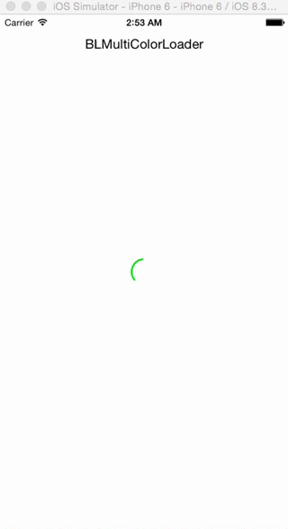

# BLMultiColorLoader

Simple, easy to use, multi coloured and customisable loading indicator (loader) for iOS applications.

[](https://travis-ci.org/Babulal Poonia/BLMultiColorLoader)
[](http://cocoapods.org/pods/BLMultiColorLoader)
[](http://cocoapods.org/pods/BLMultiColorLoader)
[](http://cocoapods.org/pods/BLMultiColorLoader)

## Screenshots



### Usage

To run the example project, clone the repo, and run `pod install` from the Example directory first.

## Requirements

## Installation

BLMultiColorLoader is available through [CocoaPods](http://cocoapods.org). To install
it, simply add the following line to your Podfile:

```ruby
pod "BLMultiColorLoader"
```

## Basic usage

Add BLMultiColorLoader class ("BLMultiColorLoader.h" and "BLMultiColorLoader.m") into your project.

```objective-c
#import <UIKit/UIKit.h>
#import "BLMultiColorLoader.h"

@interface ViewController : UIViewController

@property (weak, nonatomic) IBOutlet BLMultiColorLoader *multiColorLoader;

@end
```

```objective-c
@implementation ViewController

- (void)viewDidLoad {
[super viewDidLoad];

// Customize the line width
_multiColorLoader.lineWidth = 2.0;

// Pass the custom colors array
_multiColorLoader.colorArray = [NSArray arrayWithObjects:[UIColor redColor],
[UIColor purpleColor],
[UIColor greenColor],
[UIColor blueColor], nil];
[_multiColorLoader startAnimation];

}

- (void)doSomething
{    
[_multiColorLoader startAnimation];
[XYZService fetchSomeData:^(){
[_multiColorLoader stopAnimation];
}];
}
```

## Requirements

- iOS 7 or higher
- Automatic Reference Counting (ARC)

## Author

- [Babulal Poonia](https://github.com/BLPoonia) ([@__poonia](https://twitter.com/__poonia))

## Contribution

- [Herrick Wolber](https://github.com/rico237) ([@estar2005](https://twitter.com/estar2005))

## License

BLMultiColorLoader is released under the MIT license. See the LICENSE file for more info.
